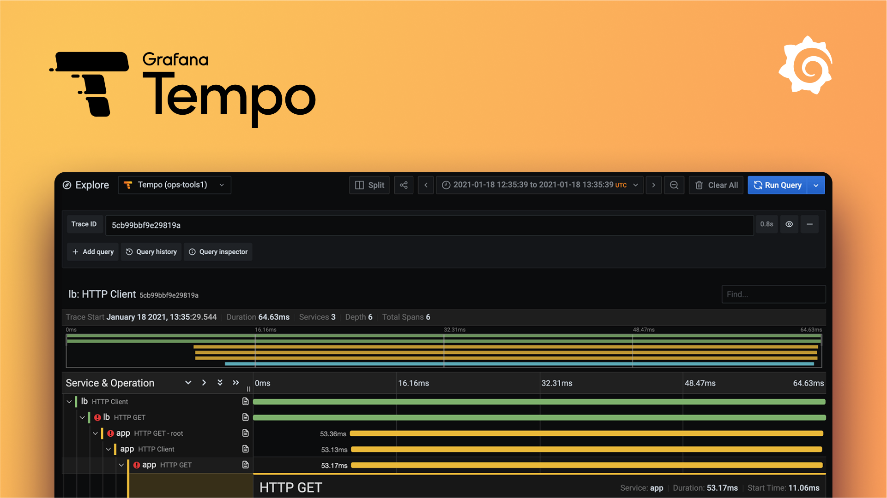

# tempo
  

 
Grafana Tempo is an open-source, high-scale distributed tracing backend that allows you to store and query traces from your applications. It is designed to be cost-effective by using object storage and minimizing indexing, making it ideal for large-scale environments. Seamlessly integrated with Grafana, Loki, and Prometheus, Tempo enables you to correlate traces with logs and metrics for comprehensive observability.
 
 

# / Deployments

 

| Deployment               | Location           | Tags            | Status     | Url                                                              |
| ------------------------ | ------------------ | --------------- | ---------- | ---------------------------------------------------------------- |
| tempo-dev-2-vm-1 | dev-2-vm |  | **active** | http://192.168.40.112  |

# References
-   [Github mirror](https://github.com/margusmuru/homelab-tempo)
-   https://grafana.com/oss/tempo/
